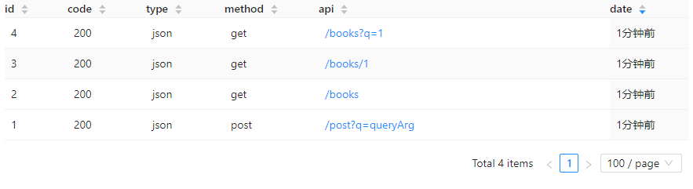
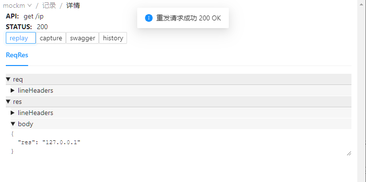
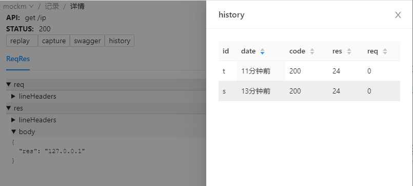
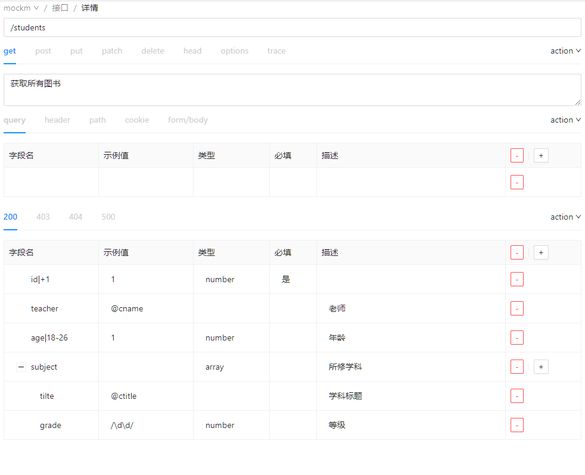

# MockM - The Ultimate API Development Companion 🚀

<p align="center">
  <strong>One-stop API mocking and debugging platform for seamless frontend-backend parallel development</strong>
</p>

<p align="center">
  <a href="https://github.com/wll8/mockm/blob/dev/README.md">中文</a> |
  <a href="https://github.com/wll8/mockm/blob/dev/README.en.md">English</a> |
  <a href="https://wll8.github.io/mockm/">📚 Documentation</a>
</p>

<p align="center">
  <a href="https://www.npmjs.com/package/mockm"></a>
  <a href="https://www.npmjs.com/package/mockm"></a>
  <a href="https://www.npmjs.com/package/mockm"></a>
  <a href="https://github.com/wll8/mockm/stargazers"></a>
</p>

<p align="center">
  
</p>

## ✨ Core Features

🎯 **Zero Configuration** - Get started with 2 commands, instant API server  
🔄 **Smart Proxy** - Non-invasive CORS solution, goodbye to CORS headaches  
📊 **Data Generation** - Built-in MockJS for realistic data generation  
🎭 **Restful API** - Auto-generated CRUD endpoints, doubled development efficiency  
🕸️ **WebSocket Support** - Complete real-time communication solution  
📱 **Visual Management** - Intuitive Web UI with drag-and-drop API management  
🔄 **Request Replay** - One-click replay of historical requests  
🌐 **Remote Debugging** - Built-in tunneling for anywhere collaboration  
⚡ **Hot Reload** - Real-time configuration updates, smooth development experience

## 🚀 Quick Start

### Get Started in 1 Minute

```bash
# Global installation
npm i -g mockm

# Start with examples
mm --config
```

🎉 **That's it!** You now have:
- ✅ CORS-enabled proxy server (http://127.0.0.1:9000)
- ✅ Visual management interface (http://127.0.0.1:9005)
- ✅ Complete API ecosystem
- ✅ Request recording and replay functionality

### Experience Immediately
- 🌐 Visit http://127.0.0.1:9000/api/1 to see API in action
- 📊 Visit http://127.0.0.1:9005/#/get/api/1 to view request details
- 🔧 Check the generated config file to explore more features

> 💡 **Tip**: The `--config` parameter creates an example configuration with common feature demonstrations

## 💡 Core Features Showcase

### 🌍 CORS Proxy - Solve All CORS Issues with One Line

**Problem**: Always frustrated by CORS errors in frontend development?  
**Solution**: MockM eliminates CORS headaches forever!

```bash
# Simplest CORS proxy
mm proxy=http://your-backend:8080
```

Or use a configuration file:
```javascript
module.exports = {
  proxy: 'http://your-backend:8080'
}
```

**Result**: Your original `http://your-backend:8080/api/users` now works through `http://127.0.0.1:9000/api/users` with automatic CORS handling!

### 🎭 Instant APIs - Create Complete Endpoints with 3 Lines

```javascript
module.exports = {
  api: {
    '/my/awesome/api': {
      message: 'My first API',
      data: { success: true }
    }
  }
}
```

**Instantly available**: http://127.0.0.1:9000/my/awesome/api

### 🔄 Restful API Generator - Complete CRUD with One Config

Want a complete blog system? Just do this:

```javascript
module.exports = {
  db: {
    posts: [
      { id: 1, title: 'My First Blog', content: 'Using MockM is incredibly simple!' }
    ]
  }
}
```

**Instantly get**:
- `GET /posts` - Get all posts
- `GET /posts/1` - Get specific post  
- `POST /posts` - Create new post
- `PUT /posts/1` - Update post
- `DELETE /posts/1` - Delete post
- `GET /posts?q=keyword` - Search posts

### 📊 Smart Data Generation - Deep MockJS Integration

```javascript
module.exports = util => ({
  db: {
    users: util.libObj.mockjs.mock({
      'data|20-50': [{
        'id|+1': 1,
        name: '@name',              // Random name
        email: '@email',            // Random email
        avatar: '@image("200x200")', // Random avatar
        'age|18-65': 1,            // Random age 18-65
        address: '@county(true)'    // Random address
      }]
    }).data
  }
})
```

### 🛠️ Response Interception & Modification - No Backend Cooperation Needed

Need to modify backend response data? Easy:

```javascript
module.exports = {
  proxy: {
    '/': 'http://your-backend:8080',
    '/api/user': ['data.name', 'John Doe'], // Change username to John Doe
    '/api/status': ['success'] // Return "success" directly
  }
}
```

### ⏱️ API Delay Simulation - Test Slow Network Conditions

```javascript
module.exports = {
  proxy: {
    '/api/slow': {
      mid(req, res, next) {
        setTimeout(next, 3000) // 3-second delay
      }
    }
  }
}
```

### 🔌 WebSocket Support - Real-time Communication Made Easy

```javascript
module.exports = {
  api: {
    'ws /chat'(ws, req) {
      ws.send('Welcome to the chat room!')
      ws.on('message', msg => {
        ws.send(`Echo: ${msg}`)
      })
    }
  }
}
```

### 📱 Visual Management - Drag-and-Drop API Management

Easily manage APIs through Web UI:
- 📋 View all API endpoints
- 🔍 Search and filter APIs  
- ✏️ Edit API logic online
- 📊 View request history and statistics
- 🔄 One-click replay historical requests

### 🌐 Remote Collaboration - One-click Tunneling

```javascript
module.exports = {
  remote: true // Enable remote access
}
```

Auto-generate public URLs supporting:
- 🌍 Remote team collaboration
- 📱 WeChat mini-program development  
- 🔗 Third-party service integration

## 🏆 Use Cases

### 👨‍💻 Frontend Developers
- **Quick Setup** Mock services without waiting for backend
- **CORS Solution** One line of code solves all CORS issues
- **Data-Driven** Develop with realistic data

### 👩‍💻 Backend Developers  
- **API Documentation** Auto-generated docs for smoother frontend integration
- **Request Parameters** One-click sharing, no more screenshot parameters
- **Debug Tools** Complete request history tracking

### 🎯 QA Engineers
- **API Testing** Built-in Postman-like tools
- **Data Simulation** Easy testing of edge cases  
- **Performance Testing** Delay and error simulation

### 👥 Team Collaboration
- **Remote Debugging** One-click public URL generation
- **Version Control** Git-friendly configuration files
- **Environment Isolation** Flexible multi-environment configs

## 📸 Interface Preview

<details>
<summary>🖱️ Click to view more interface screenshots</summary>

**Request Record Details**  


**API Request History**  


**Visual API Editor**  


</details>

## 🆚 Feature Comparison

### 📊 Comprehensive Feature Matrix

| Feature | MockM | MockJS | JSON-Server | YApi/Rap2 | Postman Mock | Wiremock | MSW | Faker.js | Apifox |
|---------|-------|--------|-------------|-----------|--------------|----------|-----|----------|--------|
| 🚀 **Zero Config** | ✅ | ❌ | ✅ | ❌ | ❌ | ❌ | ❌ | ❌ | ❌ |
| 🌐 **CORS Handling** | ✅ Auto | ❌ | ❌ | ❌ | ❌ | ✅ | ✅ | ❌ | ❌ |
| 📊 **Data Generation** | ✅ Built-in MockJS | ✅ | ❌ | ✅ | 🔶 Basic | 🔶 Basic | ✅ | ✅ | ✅ |
| 🔄 **Restful API** | ✅ Auto-generated | ❌ | ✅ | ❌ | ❌ | ✅ | ❌ | ❌ | ❌ |
| 🕸️ **WebSocket** | ✅ | ❌ | ❌ | ❌ | ❌ | ❌ | ❌ | ❌ | ❌ |
| 📱 **Visual Management** | ✅ | ❌ | ❌ | ✅ | ✅ | 🔶 3rd party | ❌ | ❌ | ✅ |
| 🔄 **Request Replay** | ✅ | ❌ | ❌ | ❌ | ✅ | ✅ | ❌ | ❌ | ✅ |
| 🌍 **Remote Debugging** | ✅ Built-in tunneling | ❌ | ❌ | ✅ | ✅ Cloud | ❌ | ❌ | ❌ | ✅ Cloud |
| ⚡ **Hot Reload** | ✅ | ❌ | ✅ | ❌ | ❌ | ✅ | ✅ | ❌ | ❌ |
| 🛠️ **Response Interception** | ✅ | ✅ Frontend only | ❌ | ❌ | ✅ | ✅ | ✅ | ❌ | ✅ |
| 💻 **Runtime** | Node.js | Browser | Node.js | Java/Docker | Cloud | Java | Browser/Node | Node.js | Desktop/Cloud |
| 💰 **Cost** | Free | Free | Free | Free/Paid | Free/Paid | Free | Free | Free | Free/Paid |

### 🎯 Tool Positioning

**Data Generation Tools**
- **MockJS**: Frontend-only data mocking, no real network requests visible
- **Faker.js**: Data generation library only, requires building your own server
- **MockM**: Built-in MockJS + complete server, ready to use

**API Server Tools** 
- **JSON-Server**: Simple REST API generation, no data generation or CORS features
- **WireMock**: Powerful Java ecosystem mock server, complex configuration
- **MockM**: Express ecosystem, simple configuration, comprehensive features

**Testing Tools**
- **Postman Mock**: Cloud-based mock service, requires internet, relatively basic features
- **MSW**: Focused on test environment request interception, steep learning curve
- **MockM**: Development + testing dual-purpose, local-first, cloud-expandable

**Platform Tools**
- **YApi/Rap2**: Enterprise API management platform, complex deployment
- **Apifox**: Commercial all-in-one API tool, powerful but paid features
- **MockM**: Lightweight local tool, focused on development efficiency

### 💡 Selection Guide

| Use Case | Recommended Tool | Reason |
|----------|------------------|--------|
| 🚀 Rapid Prototyping | **MockM** | Zero config, instant start |
| 🧪 Frontend Unit Testing | MSW + Faker.js | Professional testing toolchain |
| 🏢 Enterprise API Management | YApi + MockM | Documentation + development debugging |
| ☁️ Team Collaboration | Apifox / MockM Remote | Cloud collaboration |
| 🎯 Java Backend Testing | WireMock | Java ecosystem integration |
| 📊 Pure Data Generation | MockJS / Faker.js | Lightweight solution |

### ❓ Common Misconceptions Clarified

**🤔 "What's the difference between MockM and MockJS?"**
- **MockJS**: Only intercepts XHR requests in browser, no real network requests
- **MockM**: Runs a real server, visible in Network panel, supports CORS

**🤔 "Isn't MockM the same as JSON-Server?"**
- **JSON-Server**: Only generates simple REST APIs, no data generation capabilities
- **MockM**: REST API + Data Generation + Proxy + Visual Management + Remote Debugging

**🤔 "Why not just use Postman Mock?"**
- **Postman Mock**: Cloud service, requires internet, relatively basic features, complex setup
- **MockM**: Local-first, comprehensive features, zero-config start, optional cloud mode

**🤔 "MSW looks powerful too?"**
- **MSW**: Focused on testing environments, mainly for unit and integration tests
- **MockM**: Focused on development environments, provides complete dev server solution

**🤔 "We already have YApi/Apifox, do we still need MockM?"**
- **YApi/Apifox**: Heavy on documentation and team collaboration, still need local tools for development
- **MockM**: Perfect complement, focused on development efficiency, works great with documentation platforms

## 🤝 Community & Support

### 📚 Documentation & Tutorials
- [📖 Complete Documentation](https://wll8.github.io/mockm/)
- [🎯 Quick Start Guide](https://wll8.github.io/mockm/use/try.html)
- [💡 Best Practices](https://wll8.github.io/mockm/use/example.html)
- [🔧 Configuration Reference](https://wll8.github.io/mockm/config/option.html)

### 🌟 Related Projects

| Project | Description |
|---------|-------------|
| [🎨 Taroify](https://github.com/mallfoundry/taroify) | Taro version of mobile component library Vant, accelerating mini-program development |
| [🎯 wot-design-uni](https://github.com/Moonofweisheng/wot-design-uni) | Vue3+TS uni-app component library with 70+ high-quality components |

### 💬 Communication & Feedback
- [🐛 Bug Reports](https://github.com/wll8/mockm/issues)
- [💡 Feature Requests](https://github.com/wll8/mockm/issues)
- [❓ Usage Questions](https://github.com/wll8/mockm/discussions)

## 📄 License

This project is licensed under [MIT](https://opensource.org/licenses/MIT)

Copyright (c) 2017-present, xw

---

<p align="center">
  <strong>⭐ If this project helps you, please give us a Star!</strong>
</p>

<p align="center">
  <a href="https://github.com/wll8/mockm">
    
  </a>
</p>

