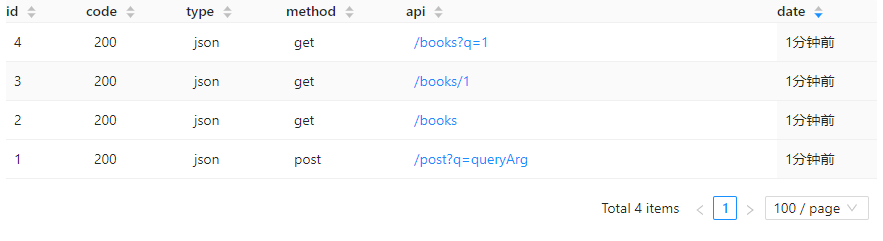
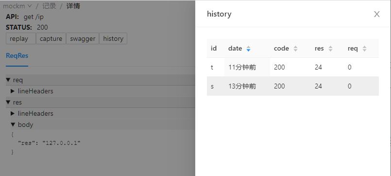
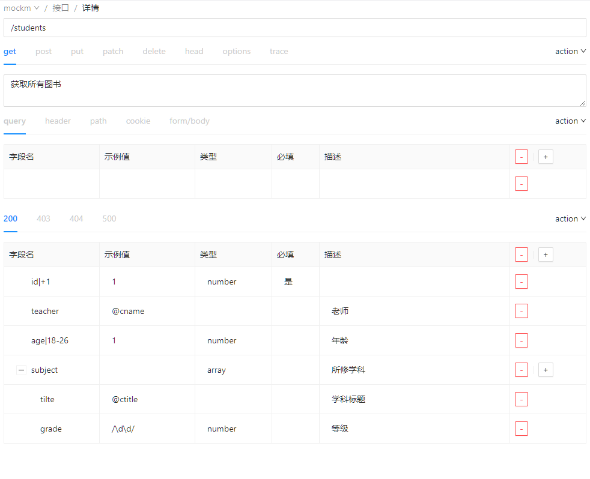

A framework based on Express. It can quickly generate APIs and create data, ready for deployment out of the box.

<p align="center">
  <a href="https://github.com/wll8/mockm/blob/dev/README.md">中文</a> |
  <a href="https://github.com/wll8/mockm/blob/dev/README.en.md">English</a>
</p>
<p align="center">
  <a href="https://www.npmjs.com/package/mockm"></a>
  <a href="https://www.npmjs.com/package/mockm"></a>
  <a href="https://www.npmjs.com/package/mockm"></a>
</p>
<p align="center">



</p>

## Try

1. **Install**: Run `npm i -g mockm` in command line
2. **Start**: Run `mm --config` in command line

All the work has been finished, and you have created your own API that allows cross-origin requests, has request recording functionality, and replay functionality...

For a quicker understanding, the `--config` parameter creates a simple example configuration [mm.config.js](https://github.com/wll8/mockm/blob/dev/server/example/simple.mm.config.js), you can take a look and explore the possibilities!

- Access http://127.0.0.1:9000/api/1 in your browser to see the effect.
- Access http://127.0.0.1:9005/#/get/api/1 in your browser to see the request details.
- For more features, please [continue](https://hongqiye.com/doc/mockm/use/example.html)...

## Function Examples

Here are some configuration examples in different scenarios, including various proxies and interceptors, API writing, and data generation methods. Please refer to the detailed documentation for [configuration items](https://hongqiye.com/doc/mockm/config/option.html).

### How to enable cross-origin requests for backend APIs

> No need to configure webpack, no need for backend personnel to make changes, no need for browser plugins

This functionality is supported by mockm by default. By starting mockm in the simplest way, you can have this functionality by running the following command in the command line.

```sh
mm proxy=http://192.168.1.18:8080
```

You can also use the configuration file method. Create a `mm.config.js` file and enter the following content, then run `mm` in the command line:

```js
module.exports = {
  proxy: `http://192.168.1.18:8080`,
};
```

Then replace the original request address with your own. For example, if your IP is 127.0.0.1, make the following changes:

- Before: http://192.168.1.18:8080/api/
- After: http://127.0.0.1:9000/api/

### How to create your own API

> When it is the same as the backend API, your own API will be used

Let's create an API in the simplest way:

```js
module.exports = {
  api: {
    "/my/api": {
      msg: `My API`,
    },
  },
};
```

The API is ready, access http://127.0.0.1:9000/my/api to see the effect.

Please refer to [config.api](https://hongqiye.com/doc/mockm/config/option.html#config-api) for details. For easier collaboration, APIs can also be created from the browser. Refer to [Interface Editing](https://hongqiye.com/doc/mockm/use/webui.html#接口编辑).

### How to get request information from an API

When we need to return different content based on the values passed in the API, it's also easy:

```js
module.exports = {
  api: {
    "/my/value"(req, res) {
      // req.params is the path parameters in the URL
      // req.query is the query parameters in the URL
      // req.body is the parameters in the request body
      res.json({ desc: `The value you passed in`, data: req.query });
    },
  },
};
```

Next, access the API and pass some URL parameters to test. For example, http://localhost:9000/my/value?city=Shanghai will result in:

```json
{
  "desc": "The value you passed in",
  "query": {
    "city": "Shanghai"
  }
}
```

### How to quickly generate Restful APIs

Let's say I want to write a list of blog articles and implement various functionalities such as adding articles, querying articles, pagination, fuzzy searching, deletion, modification, etc. for the APIs. All you need to do is add the following content:

```js
module.exports = {
  db: {
    blogs: [
      {
        id: 1,
        content: `mockm is a user-friendly and flexible interface tool. Looks good~`,
        title: `The first day of getting to know mockm`,
      },
    ],
  },
};
```

---

All the interfaces to be implemented on top have been implemented by now. Here, I use httpie as the request tool to briefly demonstrate several features. You can use your favorite tool to send requests.

```sh
# View details of a blog with id 1
http :9000/blogs/1

# Create an article about colleagues
http post :9000/blogs title="Colleague's Day" content="Today his life is still the same bitterness"

# Get all articles
http :9000/blogs

# Query articles containing 'bitterness'
http :9000/blogs?q=bitterness

# View details of a blog with id 1
http :9000/blogs/1

# Create an article about colleagues
http post :9000/blogs title="Colleague's Day" content="Today his life is still the same bitterness"

# Get all articles
http post :9000/blogs

# Query articles containing 'bitterness'
post :9000/blogs?q=bitterness

```

Please refer to [config.db](https://hongqiye.com/doc/mockm/config/option.html#config-db) for all generated interfaces.

### How to generate realistic data

[mockjs](http://mockjs.com/examples.html) is a good data generation tool. Mockm integrates it by default. The following code generates a batch of user information using mockjs.

```js
module.exports = (util) => {
  return {
    db: {
      users: util.libObj.mockjs.mock({
        "data|15-23": [
          // Generate 15 to 23 random data items
          {
            "id|+1": 1, // id starts from 1 and increments by 1
            name: `@cname`, // Generate random Chinese names
            "sex|1": [`Male`, `Female`, `Unknown`], // Randomly select one from these three genders
          },
        ],
      }).data,
    },
  };
};
```

Now you can access http://localhost:9000/users to see a lot of realistic user data.

### How to modify the data returned by the backend

> In many cases, it is inconvenient to directly modify the data on the backend because it involves a lot of logic. Writing it directly in the code on the frontend is both cumbersome and prone to problems.

Assuming that the data returned by the GET request to the backend interface `http://192.168.1.18:8080/api/user` is like this:

```js
{
  "code": 200,
  "data": {
    "books": [
      {
        "page": 52,
        "type": "css"
      },
      {
        "page": 26,
        "type": "js"
      }
    ],
    "name": "张三"
  },
  "success": true
}

```

If you want to change the type of the book at index 1 to html, the configuration is as follows:

```js
module.exports = {
  proxy: {
    "/": `http://192.168.1.18:8080`,
    "/api/user": [`data.books[1].type`, `html`], // The first parameter in the array is the path to be modified, and the second parameter is the new value
  },
};
```

If you want to directly replace the entire return value with `html`, you can do it like this:

```js
module.exports = {
  proxy: {
    "/": `http://192.168.1.18:8080`,
    "/api/user": [`html`], // If only one parameter is provided, it will be replaced directly
  },
};
```

For more ways to operate, please refer to [config.proxy](https://hongqiye.com/doc/mockm/config/option.html#config-proxy).

### How to delay the response time of the backend interface

To delay the response time of the interface `http://192.168.1.18:8080/api/user` by 5 seconds, you can do the following:

```js
module.exports = {
  proxy: {
    "/": `http://192.168.1.18:8080`,
    "/api/user": {
      mid(req, res, next) {
        setTimeout(next, 5000);
      },
    },
  },
};
```

### How to create a download file interface

Implement a file download interface http://127.0.0.1:9000/file, and send a specific file to the client.

```js
module.exports = {
  api: {
    "/file"(req, res, next) {
      res.download(`Specify the file path here`);
    },
  },
};
```

### How to create a websocket interface

Implement a websocket interface ws://127.0.0.1:9000/wsecho, send "Connection successful" when the connection is established, and echo back the message sent by the client to the client.

```js
api: {
  'ws /wsecho' (ws, req) {
    ws.send(`Connection successful`)
    ws.on('message', (msg) => {
      ws.send(msg)
    })
  }
},
```

Client connection code that can be directly tested in the browser console:

```js
function startWs(wsLink) {
  window.ws = new WebSocket(wsLink);
  ws.onopen = (evt) => {
    ws.send(`Message sent by the client`);
  };
  ws.onmessage = (evt) => {
    console.log(`Message returned by the server`, evt.data);
  };
  ws.onclose = (evt) => {
    // Reconnect
    setTimeout(() => startWs(wsLink), 1000);
  };
}
startWs(`ws://127.0.0.1:9000/wsecho`);
// ws.send(`Send a new message`)
```

### How to implement dynamic interface path parameters

Implement an interface http://127.0.0.1:9000/status/code, where "code" is a dynamic parameter in the URL, and it returns the received code.

```js
module.exports = {
  api: {
    "/status/:code"(req, res, next) {
      const { params, query, body } = req;
      res.json({ statusCode: params.code });
    },
  },
};
```

### How to display interface parameters to the backend

> No more screenshots, no more back and forth questions, no more inability to copy parameters

By default, each request will generate a link in the response header as x-test-api. Just send this link to the backend.

- Method 1
  You may see it directly on the command line when starting mockm.

- Method 2
  Look for it in the list on the page http://127.0.0.1:9005.

- Method 3
  If you use Chrome Developer Tools, you can find the requested interface in Network and find x-test-api in Response Headers.

### How to use the interface remotely

Set [config.remote](https://hongqiye.com/doc/mockm/config/option.html#config-remote) to true to have a public interface with a domain name and HTTPS certificate. This allows you to use it on WeChat official accounts or share it with others for remote use.

The "Remote Service Information" will be displayed in the console, and both x-test-api and the interface will generate corresponding remote access links.

### How to restore a backend interface that was previously working but is now broken

If a certain interface was previously working but is now broken due to some issues that the backend hasn't had time to fix, but the frontend now has pages that rely on this interface, what should you do?

On the page http://127.0.0.1:9005, select the good request history corresponding to the interface, and click on "webApi => Use this record".

### How to prevent the backend from affecting the pages when it is down

The content displayed on the pages comes from data. If the backend server has problems and all interfaces are unavailable, you can modify the request address to http://127.0.0.1:9001 to allow the pages to use the data previously returned by the server.

## Operating MockM from the UI

You can also create interfaces or operate request histories from the UI input. Below are some screenshots, please refer to the [UI instructions](https://hongqiye.com/doc/mockm/use/webui.html) for detailed documentation.

Request record details  


Request history of a certain API  


Creating an API from the UI  


## Differences

| Tool        | Description                         | Remarks                           |
| ----------- | ----------------------------------- | --------------------------------- |
| mockjs      | Intercept XHR requests in the frontend and generate data | Request cannot be seen in the network console |
| json-server | Generate Restful APIs using JSON     | Does not have integrated data generation capabilities |
| yapi/rap2   | Manage API documentation and generate interfaces and data | Difficult to install and synchronize with frontend projects |

## Links

| Project                                              | Description                                                                                                          |
| ------------------------------------------------- | --------------------------------------------------------------------------------------------------------------------- |
| [taroify](https://github.com/mallfoundry/taroify) | Taroify is the Taro version of the mobile component library Vant. Both are based on the same visual specification and provide consistent API interfaces to help developers quickly build mini-applications. |

## License

[MIT](https://opensource.org/licenses/MIT)

Copyright (c) 2017-present, xw