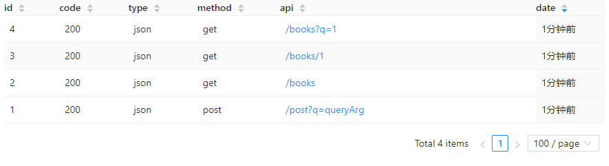
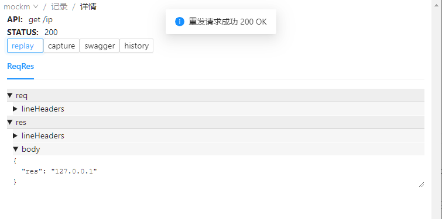
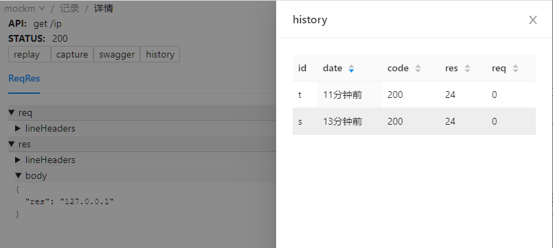
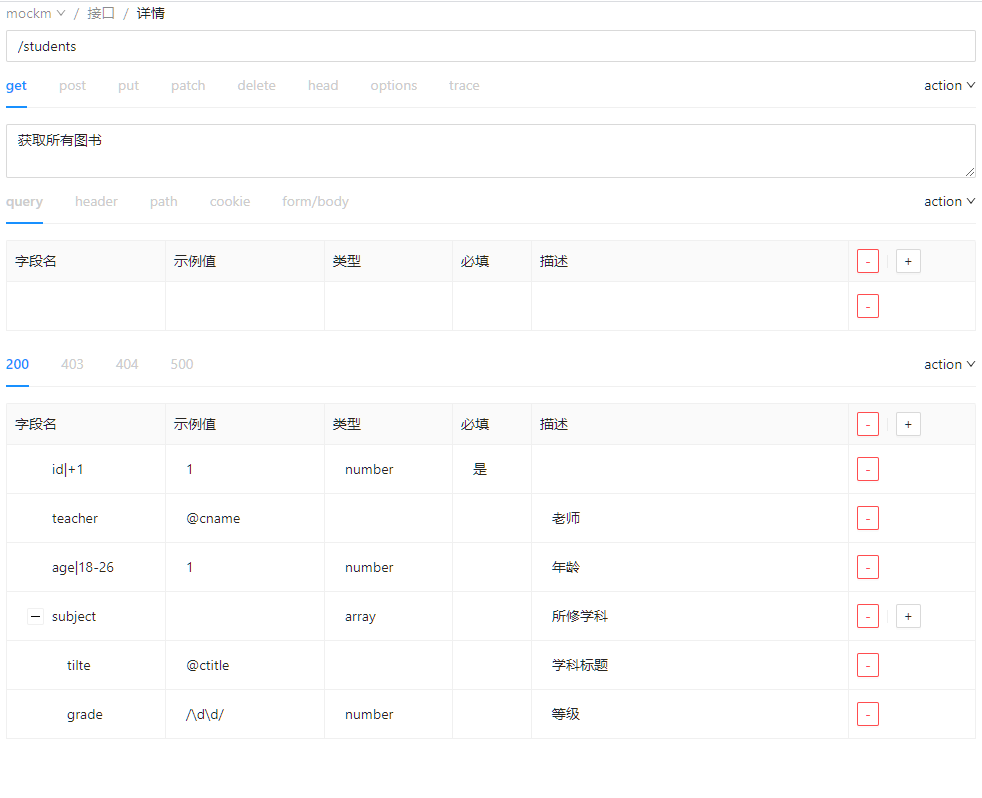

一个基于 express 的框架。它可以快速生成 api 以及创造数据，开箱即用，便于部署。


<p align="center">
  <a href="https://github.com/wll8/mockm/blob/dev/README.md">中文</a> |
  <a href="https://github.com/wll8/mockm/blob/dev/README.en.md">English</a>
</p>
<p align="center">
  <a href="https://www.npmjs.com/package/mockm"></a>
  <a href="https://www.npmjs.com/package/mockm"></a>
  <a href="https://www.npmjs.com/package/mockm"></a>
</p>
<p align="center">



</p>

## 尝试

1. **安装**: 命令行输入 `npm i -g mockm`
2. **启动**: 命令行输入 `mm --config`

所有工作已经结束了, 并且你还创建了一个自己的 api, 拥有了后端接口允许跨域的功能, 接口记录功能和重放功能...

为了让你更快的找到感觉, `--config` 这个参数创建了一个简单的示例配置 [mm.config.js](https://github.com/wll8/mockm/blob/dev/server/example/simple.mm.config.js), 你可以查看它窥探天机！

- 浏览器访问 http://127.0.0.1:9000/api/1 查看效果.
- 浏览器访问 http://127.0.0.1:9005/#/get/api/1 查看请求详情.
- 想了解更多功能请[继续](https://hongqiye.com/doc/mockm/use/example.html)...

## 功能示例

这里演示了一些不同场景下的配置, 包括各种代理和拦截, api 的编写和数据生成方式. 详细文档请参考[配置项](https://hongqiye.com/doc/mockm/config/option.html)

### 如何使后端的接口允许跨域

> 不需要配置 webpack, 不需要后端人员更改, 不需要浏览器插件

这个功能 mockm 默认是支持的, 以最简方式启动 mockm 就能拥有此功能, 只要在命令行输入下面这条命令即可.

```sh
mm proxy=http://192.168.1.18:8080
```

你也可以使用配置文件的方式, 创建 `mm.config.js` 文件并录入以下内容, 然后命令行输入 `mm` 即可:

```js
module.exports = {
  proxy: `http://192.168.1.18:8080`,
};
```

然后更换原来的请求地址为自己的即可, 例如自己的 IP 为 127.0.0.1 则做以下更改:

- 更改前: http://192.168.1.18:8080/api/
- 更改后: http://127.0.0.1:9000/api/

### 如何创建一个自己的接口

> 与后端接口相同时, 会使用自己的

让我们以最简单的方式创建一个接口:

```js
module.exports = {
  api: {
    "/my/api": {
      msg: `我的 api`,
    },
  },
};
```

接口已完成, 访问 http://127.0.0.1:9000/my/api 查看效果.

详情请参考 [config.api](https://hongqiye.com/doc/mockm/config/option.html#config-api), 为了便于多人协作, 还能从浏览器里创建, 参考 [接口编辑](https://hongqiye.com/doc/mockm/use/webui.html#接口编辑).

### 如何从接口获取请求信息

当我们需要根据接口传入的值来返回不同的内容时, 也是很容易:

```js
module.exports = {
  api: {
    "/my/value"(req, res) {
      // req.params 是 url 上的路径参数
      // req.query 是 url 上的查询参数
      // req.body 是请求体中的参数
      res.json({ desc: `你传入的值`, data: req.query });
    },
  },
};
```

接下访问接口传入一些 url 参数测试一下 http://localhost:9000/my/value?city=上海 结果为:

```json
{
  "desc": "你传入的值",
  "query": {
    "city": "上海"
  }
}
```

### 如何快速生成 Restful API

假设我要写一个博客文章的列表, 并且要实现添加文章, 查询文章, 分页, 模糊搜索, 删除, 修改等各种功能的接口. 那么只需添加以下内容:

```js
module.exports = {
  db: {
    blogs: [
      {
        id: 1,
        content: `mockm 是一款便于使用, 功能灵活的接口工具. 看起来不错~`,
        title: `认识 mockm 的第一天`,
      },
    ],
  },
};
```

这时候上面要实现的所有接口已经实现了. 这里我用 httpie 作为请求工具简单表示几个功能, 你可以使用你喜欢的工具发送请求.

```sh
# 查看 id 为 1 的博文详情
http :9000/blogs/1

# 创建一篇关于同事的文章
http post :9000/blogs title=同事的一天 content=今天他的生活还是同样的苦涩

# 获取所有文章
http :9000/blogs

# 查询所有含有 `苦涩` 的文章
http :9000/blogs?q=苦涩

# 查看 id 为 1 的博文详情
http :9000/blogs/1

# 创建一篇关于同事的文章
http post :9000/blogs title=同事的一天 content=今天他的生活还是同样的苦涩

# 获取所有文章
http post :9000/blogs

# 查询所有含有 `苦涩` 的文章
post :9000/blogs?q=苦涩

```

所有生成的接口请参考 [config.db](https://hongqiye.com/doc/mockm/config/option.html#config-db).

### 如何生成逼真的数据

[mockjs](http://mockjs.com/examples.html) 是一个不错的数据生成工具, mockm 默认集成了它, 下面用它生成一批用户信息.

```js
module.exports = (util) => {
  return {
    db: {
      users: util.libObj.mockjs.mock({
        "data|15-23": [
          // 随机生成 15 至 23 条数据
          {
            "id|+1": 1, // id 从 1 开始自增
            name: `@cname`, // 随机生成中文名字
            "sex|1": [`男`, `女`, `保密`], // 性别从这三个选项中随机选择一个
          },
        ],
      }).data,
    },
  };
};
```

现在访问 http://localhost:9000/users 已经可以看到很多逼真的用户数据了.

### 如何更改后端返回的数据

> 很多时候后端不方便直接修改数据, 因为会涉及很多逻辑, 前端直接写在代码里既麻烦又容易引发问题.

假设后台接口 `http://192.168.1.18:8080/api/user` get 请求返回的数据是这样的:

```js
{
  "code": 200,
  "data": {
    "books": [
      {
        "page": 52,
        "type": "css"
      },
      {
        "page": 26,
        "type": "js"
      }
    ],
    "name": "张三"
  },
  "success": true
}

```

如果要修改 books 索引为 1 的 type 为 html, 那么配置如下:

```js
module.exports = {
  proxy: {
    "/": `http://192.168.1.18:8080`,
    "/api/user": [`data.books[1].type`, `html`], // 数组第一个参数是修改的路径, 第二个参数是修改后的值
  },
};
```

如果要直接替换整个返回值为 `html` , 可以这样:

```js
module.exports = {
  proxy: {
    "/": `http://192.168.1.18:8080`,
    "/api/user": [`html`], // 如果只提供一个参数, 则直接替换
  },
};
```

更多操作方式请参考 [config.proxy](https://hongqiye.com/doc/mockm/config/option.html#config-proxy)

### 如何延迟后端接口的响应时间

示例延迟 `http://192.168.1.18:8080/api/user` 这个接口的响应时间为 5 秒之后:

```js
module.exports = {
  proxy: {
    "/": `http://192.168.1.18:8080`,
    "/api/user": {
      mid(req, res, next) {
        setTimeout(next, 5000);
      },
    },
  },
};
```

### 如何创建一个下载文件的接口

实现一个文件下载接口 http://127.0.0.1:9000/file, 发送某文件给客户端.

```js
module.exports = {
  api: {
    "/file"(req, res, next) {
      res.download(`这里写要下载的文件路径`);
    },
  },
};
```

### 如何创建 websocket 接口

实现一个 websocket 接口 ws://127.0.0.1:9000/wsecho, 当连接成功时发送 `连接成功`, 并把客户端发送的信息再原样返回给客户端.

```js
api: {
  'ws /wsecho' (ws, req) {
    ws.send(`连接成功`)
    ws.on('message', (msg) => {
      ws.send(msg)
    })
  }
},
```

客户端连接代码, 可以直接打开浏览器 console 测试:

```js
function startWs(wsLink) {
  window.ws = new WebSocket(wsLink);
  ws.onopen = (evt) => {
    ws.send(`客户端发送的消息`);
  };
  ws.onmessage = (evt) => {
    console.log(`服务器返回的消息`, evt.data);
  };
  ws.onclose = (evt) => {
    // 断线重连
    setTimeout(() => startWs(wsLink), 1000);
  };
}
startWs(`ws://127.0.0.1:9000/wsecho`);
// ws.send(`发送新消息`)
```

### 如何实现动态的接口路径参数

实现一个接口 http://127.0.0.1:9000/status/code, 其中 code 的位置是一个动态参数, 并返回接收到的 code.

```js
module.exports = {
  api: {
    "/status/:code"(req, res, next) {
      const { params, query, body } = req;
      res.json({ statusCode: params.code });
    },
  },
};
```

### 如何向后端展示接口参数

> 告别截图, 告别一问一答, 告别参数太多无法复制

默认情况下, 每次请求会生成一条链接在响应头中的 x-test-api 上, 把这个链接发给后端即可.

- 方法 1
  直接在启动 mockm 的命令行里可能看到.

- 方法 2
  在 http://127.0.0.1:9005 页面上的列表中查找.

- 方法 3
  如果你使用 chrome 开发工具, 可以在 Network 中找到请求的接口在 Response Headers 中找到 x-test-api.

### 如何远程使用接口

把 [config.remote](https://hongqiye.com/doc/mockm/config/option.html#config-remote) 设置为 true 就能拥有域名的和 https 证书的公网接口, 能够在微信公众号上使用, 或者发给其他人远程使用..

在控制台会显示 `远程服务信息`, x-test-api 和接口都会生成对应的远程访问链接.

### 如何恢复后端好了又坏的接口

如果某个接口之前是好的, 但是由于某些问题现在坏了, 后端又没来得及修复, 可是前端现在有页面依赖这个接口, 怎么办?

在 http://127.0.0.1:9005 页面选择对应接口的好的那条请求历史, 点击 `webApi => 使用此记录` 即可.

### 如何在后端关闭时不影响页面

页面要展示的内容来源于数据, 如果后端服务器出现问题, 所有接口无法使用, 这时候修改请求地址为 http://127.0.0.1:9001 即可让页面使用之前服务器返回的数据.

## 从界面上操作 mockm

你也可以从 UI 输入创建接口或操作请求历史，以下展示部分截图，详细文档请参考[界面说明](https://hongqiye.com/doc/mockm/use/webui.html).

请求记录详情  


某个 api 的请求历史  


从界面上创建 api  


## 区别

| 工具        | 简述                         | 备注                           |
| ----------- | ---------------------------- | ------------------------------ |
| mockjs      | 前端拦截 xhr 请求, 生成数据  | 不能在网络控制台看到请求       |
| json-server | 用 json 生成 Restful api     | 没有集成数据生成功能           |
| yapi/rap2   | 管理接口文档, 生成接口和数据 | 安装麻烦, 不方便与前端项目同步 |

## 友情链接

| 项目                                              | 简介                                                                                                                  |
| ------------------------------------------------- | --------------------------------------------------------------------------------------------------------------------- |
| [taroify](https://github.com/mallfoundry/taroify) | Taroify 是移动端组件库 Vant 的 Taro 版本，两者基于相同的视觉规范，提供一致的 API 接口，助力开发者快速搭建小程序应用。 |

## 许可

[MIT](https://opensource.org/licenses/MIT)

Copyright (c) 2017-present, xw
